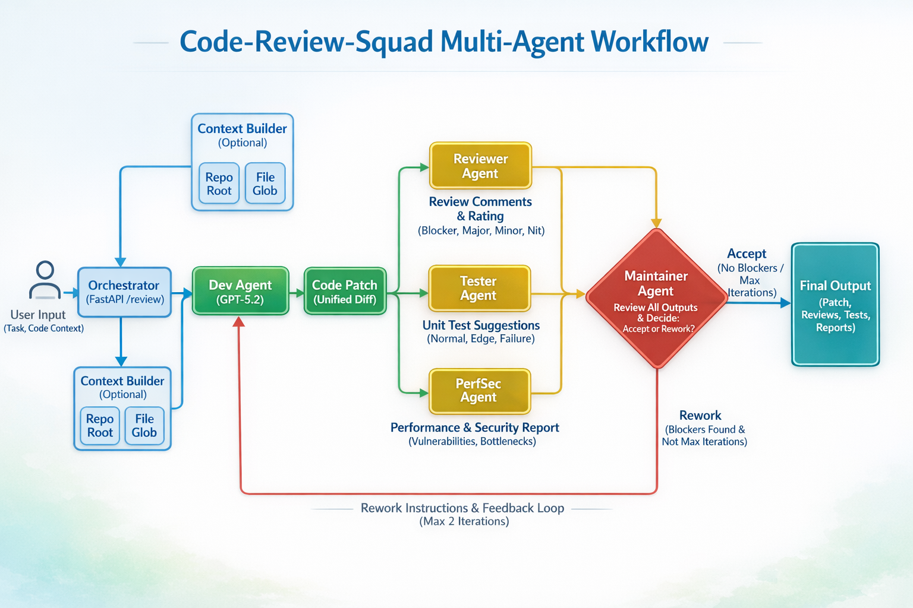

# Code-Review-Squad

一个可运行的 Multi-Agent 代码评审服务。输入需求与代码上下文，输出补丁、评审意见、测试建议和性能/安全建议。



## 功能概览

- `Dev`：生成 patch（unified diff）
- `Reviewer`：输出分级问题（`blocker/major/minor/nit`）
- `Tester`：输出测试点和可选测试 patch
- `PerfSec`：输出性能与安全风险
- `Maintainer`：根据评审结果决定 `accept` 或 `rework`，支持最多 N 轮返工

## API

`POST /review`

请求体字段：

- `task`: string，必填
- `context`: string，可选。传入后直接使用
- `repo_root`: string，可选。`context` 为空时用于自动收集上下文
- `files`: string[]，可选。指定收集哪些文件
- `include_globs`: string[]，可选。未指定 `files` 时按 glob 扫描
- `max_files`: int，默认 `20`
- `max_chars_per_file`: int，默认 `5000`
- `max_rounds`: int，默认 `2`

返回字段：

- `patch`
- `review`
- `tests`
- `perfsec`
- `maintainer`
- `rounds_used`

## Step by Step 使用说明

### 1. 克隆并进入项目目录

```powershell
git clone <your-repo-url>
cd Code-Review-Squad
```

### 2. 创建并激活虚拟环境

```powershell
python -m venv .venv
.\.venv\Scripts\Activate.ps1
```

### 3. 安装依赖

```powershell
pip install -r requirements.txt
```

### 4. 配置环境变量

在项目根目录新建 `.env` 文件：

```env
OPENAI_API_KEY=your_key
```

### 5. 启动服务

```powershell
uvicorn app.api.main:app --port 8000
```

### 6. 打开 API 文档

浏览器访问：

- http://127.0.0.1:8000/docs

### 7. 发送评审请求

方式 A：直接传入 `context`

```json
{
  "task": "Add input validation for create_user",
  "context": "File: app/user.py\n\ndef create_user(username: str):\n    return {\"username\": username}\n",
  "max_rounds": 2
}
```

方式 B：让服务自动收集本地仓库上下文

```json
{
  "task": "Refactor duplicated logic",
  "repo_root": ".",
  "files": ["app/api/main.py", "app/core/orchestrator.py"],
  "max_rounds": 2
}
```

### 8. 查看返回结果

重点查看以下字段：

- `patch`：建议修改的补丁
- `review`：评审问题和等级
- `tests`：建议补充的测试
- `perfsec`：性能与安全建议
- `maintainer`：是否接受（`accept`/`rework`）

### 9. 运行测试（可选）

```powershell
pytest -q
```

